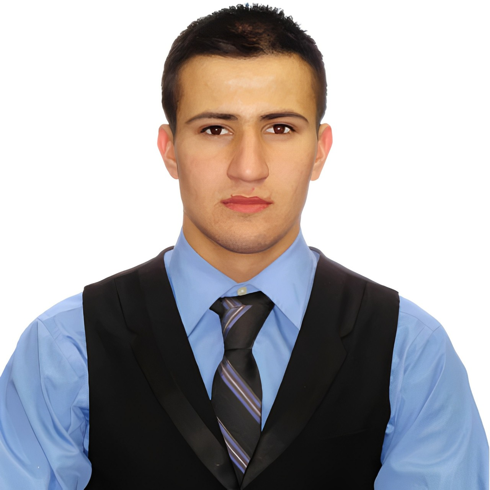

    

    

The Blindness Detection Project focuses on creating a computer-aided diagnosis system that leverages Convolutional Neural Network (CNN) algorithms for the early detection of Diabetic Retinopathy (DR), a leading cause of blindness among diabetic patients. The project involves the use of a large dataset of eye images obtained from Kaggle, which has been preprocessed and resized to a uniform size to enhance the performance of the CNN models. The project also involves the development of various CNN models using TensorFlow and Keras libraries, which will be trained on the preprocessed dataset. The performance of these models will be evaluated using different metrics, such as accuracy, sensitivity, and specificity. The ultimate goal of this project is to develop an accurate and efficient computer-aided diagnosis system that can assist healthcare professionals in the early detection of DR, thus reducing the risk of blindness among diabetic patients.

<h1></h1>

    
    

